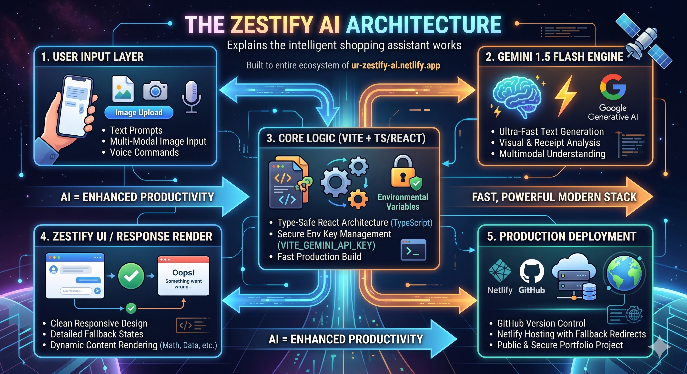

# 🌟 Zestify AI — Smart Shopping & Multimodal Intelligence Assistant

🚀 **Live Deployment:** [ur-zestify-ai.netlify.app](https://ur-zestify-ai.netlify.app/)


---

## 💡 The Philosophy: AI is a Tool, Not a Replacement

> *"AI isn't taking our jobs—it’s empowering the engineers who know how to command it."*

**Zestify AI** was built on the core belief that artificial intelligence is a profound force multiplier. Instead of viewing AI as a threat to productivity, this project treats it as an ultimate structural tool. By engineering a highly focused, responsive user interface around Google's high-speed **Gemini 1.5 Flash** model, Zestify AI demonstrates how a modern developer can leverage state-of-the-art LLMs to solve everyday user problems, streamline grocery/shopping asset management, and handle complex multimodal inputs.

---

## 🛠️ Tech Stack & Engineering Skills Showcased

Building this application required a robust understanding of modern, production-grade frontend engineering, secure data architecture, and state lifecycle management:

* **Core Framework:** `React 18` & `TypeScript` for type-safe, component-driven architecture.
* **Build System:** `Vite` for lightning-fast Hot Module Replacement (HMR) and optimized static production builds.
* **Styling & UI:** Modern, responsive CSS/Tailwind layout built for flawless mobile-first and desktop-first viewing.
* **AI Integration:** `@google/generative-ai` SDK connection to the `gemini-1.5-flash-latest` engine.
* **State Management:** Reactive component hooks tracking multimodal image array states, loading lifecycles, and fallback error handling.

---

## 📊 Project Architecture & Data Flow

To understand how Zestify AI handles real-time user prompts and rich media inputs safely, here is the architectural flowchart mapping the client-to-server lifecycle:

### App Data Stream Flowchart

[ User Action / Prompt ] ──> [ React Component State ]
│
▼
Is there an Image Attached?
/

YES                           NO
/

[ File Reader API ]                     [ Raw Text String ]
[ Convert to Base64 ]                         │
│                               │
└───────────────┬───────────────┘
│
▼
[ Secure Environment Gateway ]
(Reads VITE_GEMINI_API_KEY)
│
▼
[ Google Gemini API Endpoint ]
│
▼
[ Streamed JSON Response Object ]
│
▼
[ State Render & UI Presentation ]


---

## 🚀 Key Production Features

1. **Multimodal Analysis:** Users can upload or drag-and-drop structural image assets directly into the prompt stream, allowing Gemini to analyze visual content (receipts, items, text, shapes) instantly.
2. **Deterministic UI Feedback:** Complete protection against empty network crashes. Includes interactive error captures that graceful catch broken network loops, rendering descriptive fallback cards.
3. **Optimized Build Configuration:** Uses a dedicated client router fallback rule (`_redirects`) ensuring smooth, 404-free single page navigation when hosted on cloud web roots.
4. **Production-Ready Security:** Hardcoded credentials have been completely abstracted out of the code mapping. Production execution natively pulls from Netlify’s environment variable layer (`VITE_GEMINI_API_KEY`), keeping the repository safe, clean, and safe from bot scraping.

---

## ⚙️ How to Setup and Run Locally

Want to inspect or run this project on your machine? Follow these clean environment commands:

### 1. Clone the repository
```bash
git clone [https://github.com/reshukushwah28/Zestify_AI.git](https://github.com/reshukushwah28/Zestify_AI.git)
cd Zestify_AI
2. Install Dependencies
Bash
npm install
3. Setup Your Secure Key
Create a .env file in the root directory of the project and drop your personal API key inside:

Code snippet
VITE_GEMINI_API_KEY=your_actual_gemini_api_key_here
4. Boot Up the Development Server
Bash
npm run dev
